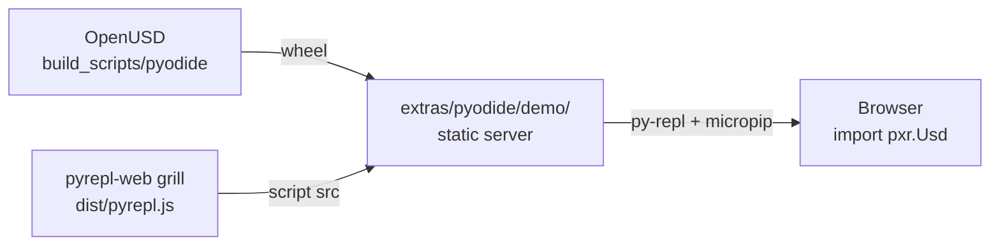

# OpenUSD Pyodide Python Bindings — Fork Implementation Plan

**Repository:** [chrizzFTD/OpenUSD](https://github.com/chrizzFTD/OpenUSD) (fork only; do not upstream to Pixar)

**Goal:** Ship `usd-core`-equivalent Python bindings as a `pyemscripten_2026_0_wasm32` wheel for interactive USD scripting in the browser via **[pyrepl-web](https://github.com/chrizzFTD/pyrepl-web)** (`grill` branch, Pyodide 314).

## Constraints (decided)

| Topic | Decision |
|-------|----------|
| Deployment | Browser via **pyrepl-web `grill`** runtime; demo assets in **this repo** (`extras/pyodide/demo/`) |
| Module scope | Match `usd-core` PyPI (no imaging); shrink if blocked |
| Architecture | wasm32 |
| Distribution | Private wheel first → PyPI when ready |
| Emscripten | Pyodide 314 xbuildenv (5.0.3), not OpenUSD CI 5.0.7 |
| Build targets | Separate `pyodide` path now; unify with `wasm` later if practical |
| First milestone | `_tf` import spike |

## Architecture overview

Two WASM modes coexist on the fork:

```
┌─────────────────────────────────────────────────────────────────┐
│  --build-target wasm          │  PXR_BUILD_PYODIDE=ON           │
│  (existing C++ embed)         │  (new browser Python path)      │
├───────────────────────────────┼─────────────────────────────────┤
│  BUILD_SHARED_LIBS=OFF        │  BUILD_SHARED_LIBS=ON           │
│  -fexceptions (JS EH)         │  -fwasm-exceptions (WASM EH)    │
│  Emscripten 5.0.7 (CI)        │  Emscripten 5.0.3 (pyodide)     │
│  Static monolithic C++        │  SIDE_MODULE wheels             │
│  No Python                    │  Boost.Python + ~22 modules     │
└───────────────────────────────┴─────────────────────────────────┘
```

Pyodide wheel layout (mirrors native `usd-core`):

```
usd_core-*.whl
├── pxr/
│   ├── __init__.py
│   ├── Tf/_tf.so          ← SIDE_MODULE=2, exports _PyInit__tf
│   ├── Usd/_usd.so
│   └── …
└── pxr/usd_m.libs/
    └── libusd_m.so        ← SIDE_MODULE=1 monolithic C++ (optional split)
```

## PR roadmap (fork)

### PR-A — Pyodide build mode + `_tf` spike (this branch)

- [x] `PXR_BUILD_PYODIDE` CMake option
- [x] Pyodide ABI compile/link flags (`-fwasm-exceptions`, `-sSUPPORT_LONGJMP=wasm`)
- [x] Allow `BUILD_SHARED_LIBS=ON` under EMSCRIPTEN when `PXR_BUILD_PYODIDE`
- [x] `_pxr_python_module()` SIDE_MODULE link options
- [x] `build_scripts/pyodide/build_spike.py`
- [x] wasm32 `TfPyObjWrapper` ABI fix (`pyObjWrapper.h`)
- [x] `_tf.so` compiles as WebAssembly SIDE_MODULE (import test pending wheel packaging)
- [ ] `from pxr import Tf` in browser via pyrepl-web + packaged private wheel

### PR-B — Full `usd-core` module set + private wheel + browser demo

All PR-B work stays **in this OpenUSD repository**. We use
**[chrizzFTD/pyrepl-web `grill`](https://github.com/chrizzFTD/pyrepl-web/tree/grill)** only as the
pre-built REPL runtime (Pyodide 314) — **no changes to the pyrepl-web repo**.

**Build & package**

- Monolithic `usd_m` SIDE_MODULE packaging (same module list as PyPI CI)
- `build_scripts/pyodide/package_wheel.py` + plugInfo layout
- Private `pyemscripten_2026_0_wasm32` wheel (served alongside the demo static files)

**Browser demo (this repo)**

Demo assets live under `extras/pyodide/demo/` (alongside the existing
`extras/usd/examples/wasmFetchResolver` C++ wasm pattern):

```
extras/pyodide/demo/
  index.html          # loads pyrepl-web from grill; hosts <py-repl>
  bootstrap.py        # micropip install of our private wheel
  usd_demo.py         # replay-src: guided USD scripting
  README.md           # how to serve locally
```

**How we consume pyrepl-web `grill` (read-only)**

| Approach | Use when |
|----------|----------|
| **Local sibling clone** | Development: clone `pyrepl-web` at `grill`, `bun run build`, serve `dist/pyrepl.js` from that tree |
| **Pinned commit URL** | CI/docs: reference a known `grill` commit’s built `dist/pyrepl.js` (e.g. GitHub raw or Release asset) |
| **`packages="usd-core"`** | After PyPI publish: pyrepl-web’s existing `micropip.install()` path via `<py-repl packages="usd-core">` |

pyrepl-web `grill` already provides what we need without forking it:

| pyrepl-web capability | How we use it |
|----------------------|---------------|
| `pyodide@^314.0.1` | Same Pyodide 314 / `pyemscripten_2026_0` ABI as our wheel |
| `loadPyodide({ indexURL: "…/v314.0.1/full/" })` | Handled inside `pyrepl.js` — we do not duplicate |
| `<py-repl packages="…">` / `src` / `replay-src` | Our demo HTML points at local `bootstrap.py` + `usd_demo.py` |
| xterm REPL + completion | Free — no custom UI in OpenUSD |

**Workflow (single repo)**



**`extras/pyodide/demo/index.html`** (sketch):

```html
<!-- pyrepl.js built from chrizzFTD/pyrepl-web @ grill (sibling clone or pinned URL) -->
<script src="/path/to/pyrepl-web/dist/pyrepl.js"></script>

<py-repl
  theme="catppuccin-mocha"
  repl-title="USD Python (Pyodide 314)"
  src="/bootstrap.py"
  replay-src="/usd_demo.py"
  no-buttons
></py-repl>
```

**`extras/pyodide/demo/bootstrap.py`** — install our wheel (served from the same static origin):

```python
import micropip

# Relative URL works when wheel is co-hosted with the demo page.
WHEEL_URL = "./usd_core-26.x.x-cp314-pyemscripten_2026_0_wasm32.whl"

async def _install():
    await micropip.install(WHEEL_URL)

import asyncio
asyncio.ensure_future(_install())
```

**`extras/pyodide/demo/usd_demo.py`**:

```python
from pxr import Usd, UsdGeom

stage = Usd.Stage.CreateInMemory()
world = UsdGeom.Xform.Define(stage, "/World")
cube = UsdGeom.Cube.Define(stage, "/World/Cube")
print("Default prim:", stage.GetDefaultPrim())
print("Cube size:", cube.GetSizeAttr().Get())
```

**Local dev** (from `extras/pyodide/demo/README.md`):

1. Build wheel: `python build_scripts/pyodide/package_wheel.py …`
2. Copy wheel into `extras/pyodide/demo/`
3. Build pyrepl-web once from `grill` (sibling directory): `bun run build`
4. Serve demo directory + pyrepl `dist/` (e.g. `python -m http.server` or small `server.js`)

**Why pyrepl-web `grill` as runtime only**

- Pyodide 314 loader, micropip, and REPL UX stay upstream in pyrepl-web
- OpenUSD owns only USD-specific assets: wheel, bootstrap, demo script, HTML glue
- No parallel `loadPyodide` boilerplate to maintain in this repo

### PR-C — CI + hardening

- GitHub Actions: `pyodide xbuildenv install 314.0.2 --force`, build, smoke tests
- Document private wheel install via pyrepl-web `bootstrap.py` pattern
- Optional: CI job that builds wheel and smoke-tests import in `pyodide venv`

## Toolchain setup

```bash
pip install 'pyodide-build>=0.36' jinja2
pyodide xbuildenv install 314.0.2 --force
pyodide xbuildenv use 314.0.2
pyodide xbuildenv install-emscripten
pyodide config list   # expect python 3.14.2, emscripten 5.0.3, abi 2026_0
```

Run spike:

```bash
pip install jinja2   # host Python; needed for USD schema codegen at configure time
python build_scripts/pyodide/build_spike.py --inst /tmp/usd-pyodide-spike
```

Use `--configure-only` to validate CMake without compiling. Use `--skip-onetbb` after the
first successful oneTBB build in `--build-root`.

## Known blockers

1. **Boost.Python on Emscripten** — untested; spike validates
2. **TBB + pthread** — reuse oneTBB wasm build; validate under Pyodide
3. **TfScriptModuleLoader** — Python `import` path should work; runtime `dlopen` plugins won't
4. **Exception ABI** — must not mix `-fexceptions` objects with Pyodide `-fwasm-exceptions`
5. **pyodide-build 0.36 vs 314** — use `xbuildenv install 314.0.2 --force` until compatibility metadata catches up
6. **TfPyObjWrapper wasm32 ABI** — `shared_ptr` is 8 bytes on wasm32; stub sizes adjusted in `pyObjWrapper.h`

## Out of scope (v1)

- Changes to the **pyrepl-web** repository (consume `grill` as read-only runtime)
- Hand-rolled `loadPyodide` HTML (pyrepl-web provides the REPL shell)
- JupyterLite, Node/pyodide venv as deployment target
- Imaging / UsdImagingGL / usdview
- wasm64 / MEMORY64
- Runtime HTTP resolvers from Python (C++ `wasmFetchResolver` pattern is future work)
