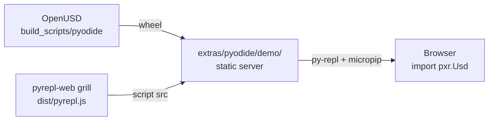

# OpenUSD Pyodide Python Bindings — Fork Implementation Plan

**Repository:** [chrizzFTD/OpenUSD](https://github.com/chrizzFTD/OpenUSD) (fork only; do not upstream to Pixar)

**Goal:** Ship `usd-core`-equivalent Python bindings as a `pyemscripten_2026_0_wasm32` wheel for interactive USD scripting in the browser via **[pyrepl-web](https://github.com/chrizzFTD/pyrepl-web)** (`grill` branch, Pyodide 314).

## Constraints (decided)

| Topic | Decision |
|-------|----------|
| Deployment | Browser via **pyrepl-web `grill`** runtime; demo assets in **this repo** (`extras/pyodide/demo/`) |
| Module scope | Match `usd-core` PyPI (no imaging); shrink if blocked |
| Architecture | wasm32 |
| Distribution | Private wheel first → PyPI when ready |
| Emscripten | Pyodide 314 xbuildenv (5.0.3), not OpenUSD CI 5.0.7 |
| Build targets | Separate `pyodide` path now; unify with `wasm` later if practical |
| First milestone | `_tf` import spike |

## Architecture overview

Two WASM modes coexist on the fork:

```
┌─────────────────────────────────────────────────────────────────┐
│  --build-target wasm          │  PXR_BUILD_PYODIDE=ON           │
│  (existing C++ embed)         │  (new browser Python path)      │
├───────────────────────────────┼─────────────────────────────────┤
│  BUILD_SHARED_LIBS=OFF        │  BUILD_SHARED_LIBS=ON           │
│  -fexceptions (JS EH)         │  -fwasm-exceptions (WASM EH)    │
│  Emscripten 5.0.7 (CI)        │  Emscripten 5.0.3 (pyodide)     │
│  Static monolithic C++        │  SIDE_MODULE wheels             │
│  No Python                    │  Boost.Python + ~22 modules     │
└───────────────────────────────┴─────────────────────────────────┘
```

Pyodide wheel layout (PR-B decided: C++ core shipped once as a shared side
module in `.libs/`, with thin per-module extensions dynamically linking it):

```
usd_core-*.whl
├── pxr/
│   ├── __init__.py        ← __all__ + runtime plugin registration bootstrap
│   ├── pluginfo/          ← plugInfo.json + schema resources
│   ├── Tf/_tf.so          ← SIDE_MODULE=2; NEEDED libusd_ms.so
│   ├── … (all ~29 modules)
└── usd_core.libs/
    └── libusd_ms.so       ← SIDE_MODULE=1; the C++ core, vendored once
```

(PR-A spike shipped a single `usd_tf_pyodide_spike-*.whl` with the static
monolith embedded inside `_tf.so` via WHOLE_ARCHIVE.)

## PR roadmap (fork)

### PR-A — Pyodide build mode + `_tf` spike (this branch)

- [x] `PXR_BUILD_PYODIDE` CMake option
- [x] Pyodide ABI compile/link flags (`-fwasm-exceptions`, `-sSUPPORT_LONGJMP=wasm`)
- [x] Allow `BUILD_SHARED_LIBS=ON` under EMSCRIPTEN when `PXR_BUILD_PYODIDE`
- [x] `_pxr_python_module()` SIDE_MODULE link options
- [x] `build_scripts/pyodide/build_spike.py`
- [x] wasm32 `TfPyObjWrapper` ABI fix (`pyObjWrapper.h`)
- [x] `_tf.so` compiles as WebAssembly SIDE_MODULE and loads under Pyodide 314
- [x] `from pxr import Tf` in browser via pyrepl-web + packaged private wheel (Node harness: `test_tf_import.mjs`)

### PR-B — Full `usd-core` module set + private wheel + browser demo

All PR-B work stays **in this OpenUSD repository**. We use
**[chrizzFTD/pyrepl-web `grill`](https://github.com/chrizzFTD/pyrepl-web/tree/grill)** only as the
pre-built REPL runtime (Pyodide 314) — **no changes to the pyrepl-web repo**.

> **Detailed design & implementation plan:** see [`PR-B-PLAN.md`](./PR-B-PLAN.md).
> Key decision: ship the C++ core **once** as a shared `libusd_ms.so`
> (`-sSIDE_MODULE=1`) vendored in the wheel's `.libs/`, with thin `_*.so`
> extensions (`-sSIDE_MODULE=2`) dynamically linking against it via RPATH —
> replacing PR-A's per-module static `WHOLE_ARCHIVE` monolith (which would
> duplicate the whole codebase ~30×). This also gives all modules one shared
> Boost.Python converter / `TfType` registry.

**Build & package**

- [x] Shared `libusd_ms.so` SIDE_MODULE + thin per-module `_*.so` extensions (~29 modules; no imaging)
- [x] `build_scripts/pyodide/package_wheel.py` + `pxr/pluginfo/` layout (mirror PyPI relocation)
- [x] Runtime plugin discovery — see note below; `pxr/__init__.py` actively calls
  `Plug.Registry().RegisterPlugins()` (not just `PXR_PLUGINPATH_NAME`)
- [x] Private `usd_core-*-pyemscripten_2026_0_wasm32` wheel, loaded + round-tripped in the Node harness
- [x] Browser demo (`extras/pyodide/demo/`) runs `usd_demo.py` under pyrepl-web `grill`

Two implementation deviations from `PR-B-PLAN.md` were required (both because
Pyodide **eagerly loads every extension `.so` at wheel-install time**, unlike a
lazy native import):

1. **Plugin path timing.** `Plug_InitConfig` (an `ARCH_CONSTRUCTOR`) reads
   `PXR_PLUGINPATH_NAME` when `libusd_ms.so` loads — during install, before
   `import pxr` runs. So the env var set in `pxr/__init__.py` is too late; the
   bootstrap instead calls `Plug.Registry().RegisterPlugins(pxr/pluginfo)` at
   import to augment the already-initialized registry (env var kept as fallback).
2. **No embedded plugInfo in side modules.** `pxr_setup_plugins()`'s
   `--embed-file` for the top-level `plugInfo.json` is `PUBLIC` and propagates
   through linking, so every module embedded the same `/usd/plugInfo.json`;
   loading a second module aborted with `EEXIST`. Gated off for Pyodide
   (`EMSCRIPTEN AND NOT PXR_BUILD_PYODIDE`), matching the resource-file gate.

**Browser demo (this repo)**

Demo assets live under `extras/pyodide/demo/` (alongside the existing
`extras/usd/examples/wasmFetchResolver` C++ wasm pattern):

```
extras/pyodide/demo/
  index.html          # loads pyrepl-web from grill; hosts <py-repl>
  bootstrap.py        # micropip install of our private wheel
  usd_demo.py         # replay-src: guided USD scripting
  README.md           # how to serve locally
```

**How we consume pyrepl-web `grill` (read-only)**

| Approach | Use when |
|----------|----------|
| **Local sibling clone** | Development: clone `pyrepl-web` at `grill`, `bun run build`, serve `dist/pyrepl.js` from that tree |
| **Pinned commit URL** | CI/docs: reference a known `grill` commit’s built `dist/pyrepl.js` (e.g. GitHub raw or Release asset) |
| **`packages="usd-core"`** | After PyPI publish: pyrepl-web’s existing `micropip.install()` path via `<py-repl packages="usd-core">` |

pyrepl-web `grill` already provides what we need without forking it:

| pyrepl-web capability | How we use it |
|----------------------|---------------|
| `pyodide@^314.0.1` | Same Pyodide 314 / `pyemscripten_2026_0` ABI as our wheel |
| `loadPyodide({ indexURL: "…/v314.0.1/full/" })` | Handled inside `pyrepl.js` — we do not duplicate |
| `<py-repl packages="…">` / `src` / `replay-src` | Our demo HTML points at local `bootstrap.py` + `usd_demo.py` |
| xterm REPL + completion | Free — no custom UI in OpenUSD |

**Workflow (single repo)**



**`extras/pyodide/demo/index.html`** (as implemented):

```html
<!-- pyrepl.js served same-origin under /pyrepl/ by server.py (single origin so
     the wrapper's dynamic ES-module import needs no cross-origin CORS). -->
<script src="/pyrepl/pyrepl.js"></script>

<py-repl
  theme="catppuccin-mocha"
  repl-title="USD Python (Pyodide 314)"
  packages="./usd_core-<ver>-cp314-cp314-pyemscripten_2026_0_wasm32.whl"
  src="./bootstrap.py"
  replay-src="./usd_demo.py"
  no-buttons
></py-repl>
```

The wheel is installed via the `packages` attribute (pyrepl `await`s
`micropip.install(packages)` **before** starting the REPL/replay). A `src`
startup script cannot install it: pyrepl exec's `src` synchronously, so an
`asyncio.ensure_future(micropip.install(...))` there races the replay.
`bootstrap.py` is therefore a silent `import pxr` (runs the wheel's bundled
plugin registration); `usd_demo.py` is the replayed demo. `server.py` serves the
demo dir and mounts the pyrepl-web `dist/` under `/pyrepl/` from one origin.

**`extras/pyodide/demo/usd_demo.py`**:

```python
from pxr import Usd, UsdGeom

stage = Usd.Stage.CreateInMemory()
world = UsdGeom.Xform.Define(stage, "/World")
cube = UsdGeom.Cube.Define(stage, "/World/Cube")
print("Default prim:", stage.GetDefaultPrim())
print("Cube size:", cube.GetSizeAttr().Get())
```

**Local dev** (from `extras/pyodide/demo/README.md`):

1. Build wheel: `python build_scripts/pyodide/package_wheel.py …`
2. Copy wheel into `extras/pyodide/demo/`
3. Build pyrepl-web once from `grill` (sibling directory): `bun run build`
4. Serve demo directory + pyrepl `dist/` (e.g. `python -m http.server` or small `server.js`)

**Why pyrepl-web `grill` as runtime only**

- Pyodide 314 loader, micropip, and REPL UX stay upstream in pyrepl-web
- OpenUSD owns only USD-specific assets: wheel, bootstrap, demo script, HTML glue
- No parallel `loadPyodide` boilerplate to maintain in this repo

### PR-C — CI, size hardening, and PyPI release as `grill-usd-core`

> **Detailed design & implementation plan:** see [`PR-C-PLAN.md`](./PR-C-PLAN.md).
> Key decision: publish the wasm wheel to **PyPI as `grill-usd-core`** (the
> testing package for the Pyodide/wasm build of `usd-core`, distinct from
> Pixar's official `usd-core` which has no wasm support). PEP 783 makes the
> `pyemscripten_2026_0_wasm32` tag PyPI-installable, so consumers can
> `micropip.install("grill-usd-core")` / `<py-repl packages="grill-usd-core">`.

- [x] `package_wheel.py --dist-name` (default `grill-usd-core`; import name
  stays `pxr`) → `grill_usd_core-<ver>-…-pyemscripten_2026_0_wasm32.whl` with
  the monolith in `grill_usd_core.libs/`; Node harness re-validated after the
  rename (R1 gate)
- [x] Complete PyPI metadata (`pypi_readme.md` long description, TOST-1.0
  license + bundled `LICENSE.txt`, `Environment :: WebAssembly :: Emscripten`
  classifier, project URLs) + `twine check --strict` in the packager
- [x] `pyodide venv` pip-install smoke test (`test_pyodide_venv.sh`) alongside
  the Node harness
- [x] Size hardening deferred from PR-B: post-link `wasm-opt -Oz` + strip on
  `libusd_ms.so` in the packager (~8% smaller monolith; a `MinSizeRel`/`-Oz`
  *compile* was measured and is larger than `-O3` here, so `Release` stays
  the default — see `build_spike.py --build-type`)
- [x] GitHub Actions (`.github/workflows/pyodide-wheel.yml`): xbuildenv +
  oneTBB caching, build → package → `twine check` → Node + `pyodide venv`
  smoke tests → publish via PyPI Trusted Publishing (TestPyPI first)
- [x] TestPyPI dry-run: `grill-usd-core==26.8.dev1` published to
  [test.pypi.org](https://test.pypi.org/project/grill-usd-core/) and validated
  end-to-end (Node harness `index_urls` install + `pyodide venv` pip install
  from the TestPyPI index; metadata renders correctly)
- [ ] Maintainer: configure Trusted Publishing (TestPyPI + PyPI) + the
  `testpypi`/`pypi` GitHub environments, land the workflow on the default
  branch, then run the PyPI publish workflow (see PR-C-PLAN §4.4)
- [x] Repoint the browser demo at `packages="grill-usd-core"` (keep the
  local-wheel path for development)

## Distribution

The Pyodide wheel is distributed on **PyPI as
[`grill-usd-core`](https://pypi.org/project/grill-usd-core/)** — an unofficial,
experimental WebAssembly build of the `usd-core` module set (import name is
still `pxr`). Consumption:

```python
import micropip
await micropip.install("grill-usd-core")      # browser / Node (Pyodide 314)
```

```html
<py-repl packages="grill-usd-core"></py-repl>  <!-- pyrepl-web grill -->
```

```bash
pyodide venv .venv-pyodide                     # native PEP 783 install path
.venv-pyodide/bin/pip install grill-usd-core
```

Wheels are built + published by `.github/workflows/pyodide-wheel.yml`
(`workflow_dispatch` with `publish: testpypi|pypi`, or a `pyodide-v*` tag).
Versions mirror USD (`26.8`), with `.postN` for re-publishes and `.devN` on
TestPyPI (PyPI files are immutable). Local wheels remain fully supported for
development (`packages="./grill_usd_core-*.whl"`, direct `micropip.install`
URL, or a TestPyPI `index_urls`).

## Toolchain setup

```bash
pip install 'pyodide-build>=0.36' jinja2
pyodide xbuildenv install 314.0.2 --force
pyodide xbuildenv use 314.0.2
pyodide xbuildenv install-emscripten
pyodide config list   # expect python 3.14.2, emscripten 5.0.3, abi 2026_0
```

Run spike:

```bash
pip install jinja2   # host Python; needed for USD schema codegen at configure time
python build_scripts/pyodide/build_spike.py --inst /tmp/usd-pyodide-spike
```

Use `--configure-only` to validate CMake without compiling. Use `--skip-onetbb` after the
first successful oneTBB build in `--build-root`.

## Known blockers

1. **Boost.Python on Emscripten** — validated by PR-A `from pxr import Tf`; PR-B
   confirms the shared cross-module converter registry (e.g. `Gf.Vec3d` into
   `UsdGeom` authoring, serialized via `Sdf`) works with one `libusd_ms.so`
2. **TBB + pthread** — oneTBB wasm build works; TBB still references some `pthread_*` stubs but load succeeds without `-pthread` compile flags
3. **TfScriptModuleLoader** — Python `import` path works across all ~29 modules; no runtime `dlopen` plugins needed (the monolithic core has empty `LibraryPath`)
4. **Exception ABI** — must not mix `-fexceptions` objects with Pyodide `-fwasm-exceptions`
5. **pyodide-build 0.36 vs 314** — use `xbuildenv install 314.0.2 --force` until compatibility metadata catches up
6. **TfPyObjWrapper wasm32 ABI** — `shared_ptr` is 8 bytes on wasm32; stub sizes adjusted in `pyObjWrapper.h`. No further wasm32 ABI issues surfaced across the full module graph in PR-B
7. **No `-pthread` on Pyodide wheels** — pyemscripten ABI forbids it; also omit `-pthread` compile flags (`gccclangshareddefaults.cmake`) so SIDE_MODULEs do not import `pthread_*` from `env`

**Resolved in PR-B**

8. ~~**Monolith packaging** — a separate `libusd_ms.so` SIDE_MODULE failed to
   load under Pyodide 314.~~ **Resolved.** The shared-monolith model is the
   decided layout: `libusd_ms.so` (`-sSIDE_MODULE=1`) is vendored into
   `usd_core.libs/` and thin `_*.so` extensions (`-sSIDE_MODULE=2`) dynamically
   link it. The original failure was **not** the side module itself but the
   `--embed-file` top-level plugInfo baked (via `PUBLIC` link propagation) into
   every module, causing an `EEXIST` when a second module reloaded the embedded
   file. Gating the embed off for Pyodide fixed loading; plugin discovery then
   works via runtime `Plug.Registry().RegisterPlugins()` (see PR-B notes above).
   `pyodide auditwheel repair` vendors the lib and pyodide loads it via the
   `LD_LIBRARY_PATH` (`DSO_DIR` / site-packages) search + NEEDED resolution.

## Out of scope (v1)

- Changes to the **pyrepl-web** repository (consume `grill` as read-only runtime)
- Hand-rolled `loadPyodide` HTML (pyrepl-web provides the REPL shell)
- JupyterLite, Node/pyodide venv as deployment target
- Imaging / UsdImagingGL / usdview
- wasm64 / MEMORY64
- Runtime HTTP resolvers from Python (C++ `wasmFetchResolver` pattern is future work)
