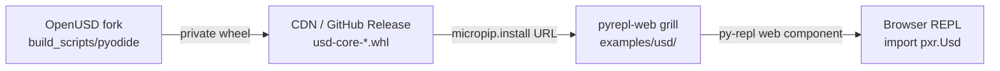

# OpenUSD Pyodide Python Bindings — Fork Implementation Plan

**Repository:** [chrizzFTD/OpenUSD](https://github.com/chrizzFTD/OpenUSD) (fork only; do not upstream to Pixar)

**Goal:** Ship `usd-core`-equivalent Python bindings as a `pyemscripten_2026_0_wasm32` wheel for interactive USD scripting in the browser via **[pyrepl-web](https://github.com/chrizzFTD/pyrepl-web)** (`grill` branch, Pyodide 314).

## Constraints (decided)

| Topic | Decision |
|-------|----------|
| Deployment | Browser only — **[chrizzFTD/pyrepl-web](https://github.com/chrizzFTD/pyrepl-web) `grill` branch** (Python 3.14 / Pyodide 314) |
| Module scope | Match `usd-core` PyPI (no imaging); shrink if blocked |
| Architecture | wasm32 |
| Distribution | Private wheel first → PyPI when ready |
| Emscripten | Pyodide 314 xbuildenv (5.0.3), not OpenUSD CI 5.0.7 |
| Build targets | Separate `pyodide` path now; unify with `wasm` later if practical |
| First milestone | `_tf` import spike |

## Architecture overview

Two WASM modes coexist on the fork:

```
┌─────────────────────────────────────────────────────────────────┐
│  --build-target wasm          │  PXR_BUILD_PYODIDE=ON           │
│  (existing C++ embed)         │  (new browser Python path)      │
├───────────────────────────────┼─────────────────────────────────┤
│  BUILD_SHARED_LIBS=OFF        │  BUILD_SHARED_LIBS=ON           │
│  -fexceptions (JS EH)         │  -fwasm-exceptions (WASM EH)    │
│  Emscripten 5.0.7 (CI)        │  Emscripten 5.0.3 (pyodide)     │
│  Static monolithic C++        │  SIDE_MODULE wheels             │
│  No Python                    │  Boost.Python + ~22 modules     │
└───────────────────────────────┴─────────────────────────────────┘
```

Pyodide wheel layout (mirrors native `usd-core`):

```
usd_core-*.whl
├── pxr/
│   ├── __init__.py
│   ├── Tf/_tf.so          ← SIDE_MODULE=2, exports _PyInit__tf
│   ├── Usd/_usd.so
│   └── …
└── pxr/usd_m.libs/
    └── libusd_m.so        ← SIDE_MODULE=1 monolithic C++ (optional split)
```

## PR roadmap (fork)

### PR-A — Pyodide build mode + `_tf` spike (this branch)

- [x] `PXR_BUILD_PYODIDE` CMake option
- [x] Pyodide ABI compile/link flags (`-fwasm-exceptions`, `-sSUPPORT_LONGJMP=wasm`)
- [x] Allow `BUILD_SHARED_LIBS=ON` under EMSCRIPTEN when `PXR_BUILD_PYODIDE`
- [x] `_pxr_python_module()` SIDE_MODULE link options
- [x] `build_scripts/pyodide/build_spike.py`
- [x] wasm32 `TfPyObjWrapper` ABI fix (`pyObjWrapper.h`)
- [x] `_tf.so` compiles as WebAssembly SIDE_MODULE (import test pending wheel packaging)
- [ ] `from pxr import Tf` in browser via pyrepl-web + packaged private wheel

### PR-B — Full `usd-core` module set + private wheel + pyrepl-web demo

**Build & package (this repo — OpenUSD fork)**

- Monolithic `usd_m` SIDE_MODULE packaging (same module list as PyPI CI)
- `build_scripts/pyodide/package_wheel.py` + plugInfo layout
- Private `pyemscripten_2026_0_wasm32` wheel (hosted on CDN/GitHub Releases before PyPI)

**Browser demo (pyrepl-web fork — not raw `loadPyodide` HTML)**

Demo lives in **[chrizzFTD/pyrepl-web](https://github.com/chrizzFTD/pyrepl-web)** on the **`grill`** branch, which already ships:

| pyrepl-web capability | Relevance for USD |
|----------------------|-------------------|
| `pyodide@^314.0.1` npm dep | Matches our Pyodide 314 xbuildenv / `pyemscripten_2026_0` target |
| `loadPyodide({ indexURL: "…/v314.0.1/full/" })` | Same runtime ABI we compile against |
| `<py-repl packages="…">` | Preloads wheels via **micropip** at REPL startup |
| `src` / `replay-src` attributes | Bootstrap + guided USD scripting demo scripts |
| xterm.js REPL + tab completion | Interactive USD exploration without custom UI work |

**Cross-repo workflow**



**Demo files to add in pyrepl-web (`grill` branch)**

```
pyrepl-web/
  examples/
    usd/
      index.html          # py-repl page for USD demo
      bootstrap.py        # silent src: micropip install private wheel
      usd_demo.py         # replay-src: guided Stage.Open / traversal
```

**`examples/usd/index.html`** (sketch — uses pyrepl-web, not hand-rolled Pyodide):

```html
<script src="/dist/pyrepl.js"></script>

<!-- bootstrap.py installs the private wheel; usd_demo.py is replayed with >>> prompts -->
<py-repl
  theme="catppuccin-mocha"
  repl-title="USD Python (Pyodide 314)"
  src="/examples/usd/bootstrap.py"
  replay-src="/examples/usd/usd_demo.py"
  no-buttons
></py-repl>
```

**`examples/usd/bootstrap.py`** — install private wheel before REPL accepts input:

```python
import micropip

# Until usd-core is on PyPI, point at a hosted pyemscripten wheel.
# Wheel must be tagged: cp314-pyemscripten_2026_0_wasm32
WHEEL_URL = "https://<your-cdn>/usd_core-26.x.x-cp314-pyemscripten_2026_0_wasm32.whl"

async def _install():
    await micropip.install(WHEEL_URL)

import asyncio
asyncio.ensure_future(_install())
```

**`examples/usd/usd_demo.py`** — replayed interactively (`replay-src` or `src` + `replay`):

```python
from pxr import Usd, UsdGeom

# Create an in-memory stage (no filesystem needed in browser)
stage = Usd.Stage.CreateInMemory()
world = UsdGeom.Xform.Define(stage, "/World")
cube = UsdGeom.Cube.Define(stage, "/World/Cube")
print("Default prim:", stage.GetDefaultPrim())
print("Cube size:", cube.GetSizeAttr().Get())
```

**Why pyrepl-web instead of a minimal HTML page**

- No need to maintain parallel Pyodide 314 loader / indexURL / micropip boilerplate
- `packages` attribute pattern extends naturally: once `usd-core` is on PyPI with a
  `pyemscripten_2026_0_wasm32` wheel, demo simplifies to `packages="usd-core"`
- Tab completion and multi-line editing matter for interactive USD scripting
- `grill` branch is already on Python 3.14 — no ABI mismatch with our build target

**OpenUSD repo scope for PR-B** (this fork only)

- Wheel build scripts + documented wheel URL for pyrepl-web demo
- Link from `docs/pyodide/PLAN.md` to pyrepl-web `examples/usd/`
- Do **not** duplicate a standalone `loadPyodide` HTML demo here

**pyrepl-web repo scope** (separate PR on chrizzFTD/pyrepl-web `grill`)

- Add `examples/usd/` as above
- Optional: dev-server static route for hosted `.whl` during local testing
- README section: “USD / OpenUSD” pointing back to OpenUSD fork docs

### PR-C — CI + hardening

- GitHub Actions: `pyodide xbuildenv install 314.0.2 --force`, build, smoke tests
- Document private wheel install via pyrepl-web `bootstrap.py` pattern
- Optional: CI job that builds wheel and smoke-tests import in `pyodide venv`

## Toolchain setup

```bash
pip install 'pyodide-build>=0.36' jinja2
pyodide xbuildenv install 314.0.2 --force
pyodide xbuildenv use 314.0.2
pyodide xbuildenv install-emscripten
pyodide config list   # expect python 3.14.2, emscripten 5.0.3, abi 2026_0
```

Run spike:

```bash
pip install jinja2   # host Python; needed for USD schema codegen at configure time
python build_scripts/pyodide/build_spike.py --inst /tmp/usd-pyodide-spike
```

Use `--configure-only` to validate CMake without compiling. Use `--skip-onetbb` after the
first successful oneTBB build in `--build-root`.

## Known blockers

1. **Boost.Python on Emscripten** — untested; spike validates
2. **TBB + pthread** — reuse oneTBB wasm build; validate under Pyodide
3. **TfScriptModuleLoader** — Python `import` path should work; runtime `dlopen` plugins won't
4. **Exception ABI** — must not mix `-fexceptions` objects with Pyodide `-fwasm-exceptions`
5. **pyodide-build 0.36 vs 314** — use `xbuildenv install 314.0.2 --force` until compatibility metadata catches up
6. **TfPyObjWrapper wasm32 ABI** — `shared_ptr` is 8 bytes on wasm32; stub sizes adjusted in `pyObjWrapper.h`

## Out of scope (v1)

- Hand-rolled `loadPyodide` HTML demos (use **pyrepl-web `grill`** instead)
- JupyterLite, Node/pyodide venv as deployment target
- Imaging / UsdImagingGL / usdview
- wasm64 / MEMORY64
- Runtime HTTP resolvers from Python (C++ `wasmFetchResolver` pattern is future work)
